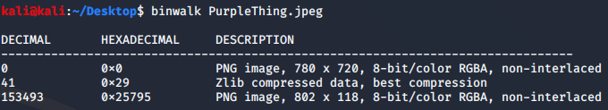
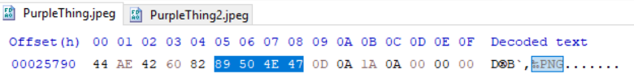
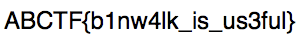

Link: https://ctflearn.com/challenge/108

# Description
Here is a file with another file hidden inside it. Can you extract it? https://mega.nz/#!qbpUTYiK!-deNdQJxsQS8bTSMxeUOtpEclCI-zpK7tbJiKV0tXYY

# Process
The tool needed is in the title! Running ```binwalk PurpleThing.jpeg``` will show the existence of data after the Zlib section, which in a typical PNG image doesn't exist.



I wasn't able to get binwalk to extract it manually, which is fine since it provided the hex offset ```0x25795``` needed for me to grab it through HxD.



As we can see, there appears to be a 2nd PNG header nested within the original file. If we copy this header down to the end of the entire file and put it into a new file, we can view the flag within:



# Flag
**ABCTF{b1nw4lk_is_us3ful}**