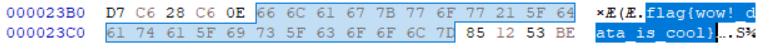

So this one was pretty simple. I know you could use ```strings``` to find the flag, but when I think digital forensics, personally my first thought is hex dumps/hex editors.

Link: https://ctflearn.com/challenge/96

# Description
Think the flag is somewhere in there. Would you help me find it?

# Process
A jpeg file! Usually if a flag is hidden inside of a file it's through nesting files (which can be extracted using foremost or binwalk), obfuscating the flag through crypto or just simply steganography.

In this case, opening the image reveals your a classic Facebook minion meme :)


Nothing in the image itself, so it's time to move into slightly more advanced territories. I used HxD to continue my search, though xxd, hexdump, etc will work fine too. 

Wasn't sure what to look with initially, so I simply searched up the string "flag" and actually got the flag, which in hex is ```66 6C 61 67 7B 77 6F 77 21 5F 64 61 74 61 5F 69 73 5F 63 6F 6F 6C 7D``` and is located at offset ```0x23B5-0x23CB```.



# Flag
**flag{wow!_data_is_cool}**