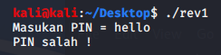

When first running the file, you get the input "Masukan PIN =" (which is Indonesian for "Enter PIN" I think). Entering anything other than the correct password gets the response of "PIN salah !" (or "PIN wrong!, I think").

