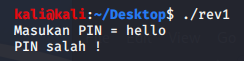
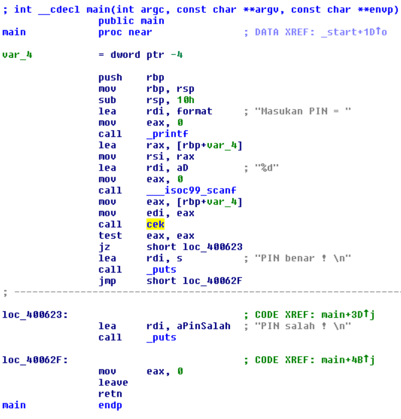
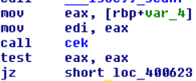
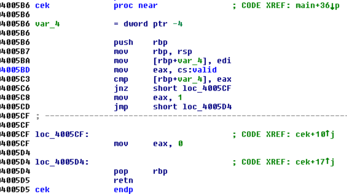
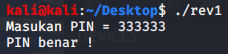

# Explanation
When first running the file, you get the input ```"Masukan PIN = "``` (which is Indonesian for "Enter PIN" I think). Entering anything other than the correct password gets the response of ```"PIN salah !"``` (or "PIN wrong!, I think").



Now that we have a basic idea of how the program works, we can disassemble it. Here's the disassembly of main:



As you can see, we can already derive where the strings ```"Masukan PIN = "``` and ```"PIN salah !"``` come from. There is a third string of interest, referred to as "c" with the contents of ```"PIN benar !"``` - which means "PIN right".

With that in mind, we particularly want to pay attention to the section between the ```scanf``` (offset 0x400607) and right before the string (0x400615):



There are two instructions of note: ```call cek``` (offset 0x40060C) and ```jz short loc_400623``` (offset 0x400613). The ```jz``` instruction simply causes a jump to the "PIN salah !" output we've seen before. The ```call``` instruction jumps up to the ```cek``` subroutine, which looks like this:



In this subroutine, [rbp+var_4] is our input PIN. The ```eax``` register gets filled with ```valid``` from the current segment (```.text```). ```valid``` has a value of 0x51615, or 333333 in decimal


Going back to ```cek```, we can now see that ```eax``` (valid) gets compared to ```[rbp+var_4]``` (input PIN). If the input PIN is not ```333333``` the program will return true (1) or false (0) and return back to the main subroutine that prints the benar/salah strings.

Once the password is confirmed to be correct, you can send in the flag.




# Flag
Flag = **flag{333333}**