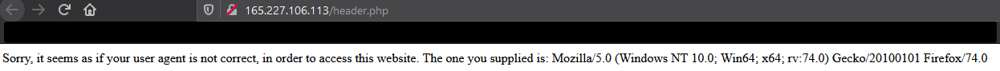
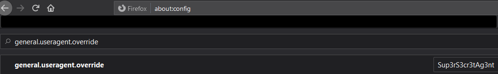
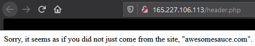
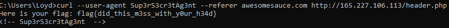

In retrospect, Burp Suite possibly could have made this easier but I need more practice with it to be more comfortable with using it.

Link: https://ctflearn.com/challenge/109

# Description
Try to bypass my security measure on this site! http://165.227.106.113/header.php

# Process
So this one threw me off for a little bit. Navigating to the site from my browser returned with no authorization:



However, viewing the source code reveals the string ```Sup3rS3cr3tAg3nt```. It's probable that the site expects your user agent to match that string instead of Mozilla, Chrome, etc. 

I wasn't sure how to do this on Firefox, but with some quick Googling revealed that going to about:config and putting in ```general.useragent.override``` into the search bar, and creating a new string with the value "Sup3rS3cr3tAg3nt" to override what Firefox was providing to the site.



Now that I go back to the site though, I was hit with another error! It now requires that I come from the site "awesomesauce.com":



I wasn't sure how to manipulate the referrer in my request header through Firefox without having to install random extensions, so I turned towards cURL as I believe I could do so with the correct options.

The following command is crafted such that the web server believes your user agent to be the one discovered previously and that you were referred from "awesomesauce.com."

```curl --user-agent Sup3rS3cr3tAg3nt --referer awesomesauce.com http://165.227.106.113/header.php```

Running this command in any terminal/prompt will return the flag from the web server: 



# Flag
**flag{did_this_m3ss_with_y0ur_h34d}**